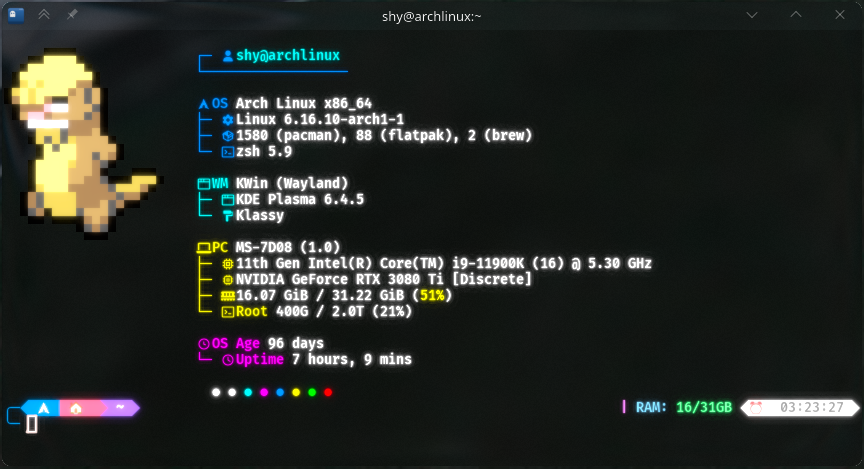

# My Ghostty Shaders

A collection of custom shaders for the [Ghostty](https://ghostty.org) terminal.
These shaders aim to enhance the visual feel of your terminal while maintaining readability and performance.

---

## 🌸 Current Shader

### **ShyBloom.glsl**

A subtle bloom effect that gives your terminal a soft, glowing aesthetic — especially noticeable with lighter color schemes.
Unlike a traditional Gaussian blur, which can be heavy on performance, **ShyBloom** uses a simplified, efficient technique to achieve a similar visual smoothness at a fraction of the cost.
Despite its visual flair, it remains lightweight and optimized, ensuring your terminal stays fast and responsive even on lower-end systems.

**Path:** `Shaders/ShyBloom.glsl`

**Preview:**


#### Adjustable Parameters

Inside the shader file, you’ll find parameters you can tune to your liking:

```glsl
// Adjustable parameters
float blurStrength = 2;    // 1.0 = original size, >1 = bigger glow
float bloomBrightness = 2; // 1.0 = original brightness, >1 = brighter
```

These values control the **intensity** and **size** of the bloom.
Experiment to find the balance that fits your terminal theme and lighting conditions.

---

## 🧩 Installation

1. Make sure you’re running the latest version of **Ghostty** with shader support enabled.

2. Copy the desired shader file (e.g., `ShyBloom.glsl`) to your Ghostty shaders directory.

3. Update your Ghostty configuration (usually `~/.config/ghostty/config`):

   ```ini
   custom-shader = shaders/ShyBloom.glsl
   ```

4. Restart Ghostty to apply the shader or do `CTRL` + `,`.

---

## 🧠 Notes

* Shaders are written in GLSL and designed specifically for Ghostty’s rendering pipeline.
* Parameters can be edited directly in the shader file to customize the effect.
* Changes take effect after reloading Ghostty.
* **ShyBloom.glsl** is performance-optimized and has minimal GPU overhead.

---

## 🪄 Future Plans

* Add more shader effects (whatever comes to my mind)
* Provide configurable presets
* Offer performance-optimized versions

---

## 📜 License

This project is released under the [MIT License](LICENSE).
